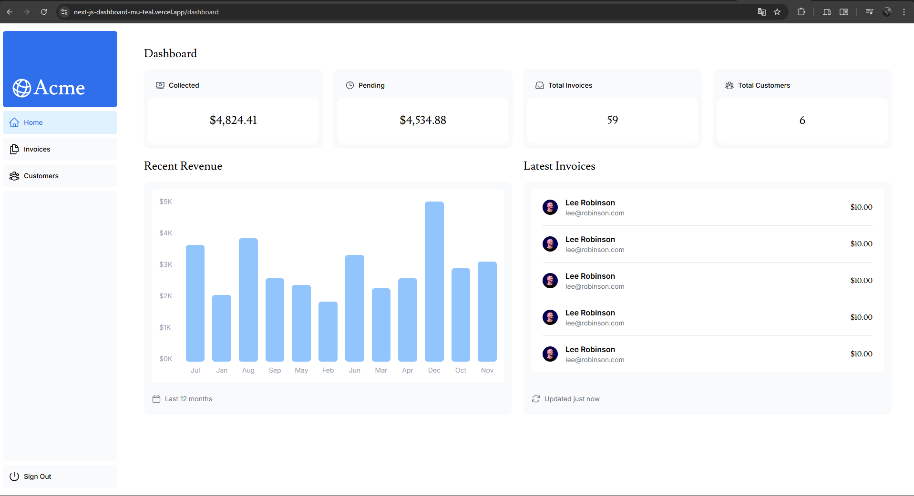

# Tableau de Bord Next.js <code>(En cours)</code>

Ce projet est une application de tableau de bord complète construite avec Next.js, suivant le tutoriel officiel <strong>"Learn Next.js"</strong>. Il met en œuvre des fonctionnalités essentielles telles que l'authentification, la gestion de données (clients et factures), et l'affichage de statistiques.

<p align="center">
    
    
    
    
</p>

## ✨ Fonctionnalités

- **Authentification des utilisateurs** : Pages de connexion sécurisées avec `Next-Auth`.
- **Tableau de bord** : Une page d'accueil avec des statistiques clés (revenus, factures en attente, etc.).
- **Gestion des factures** : Créer, Modifier, Supprimer et Consulter des factures avec pagination et recherche.
- **Gestion des clients** : Affichage d'une table de clients.
- **Mise à jour en temps réel** : Utilisation de `use-debounce` pour une recherche fluide sans surcharger le serveur.
- **Validation des données** : Schémas de validation robustes avec `Zod`.

## 🛠️ Stack Technique

- **Framework** : [Next.js](https://nextjs.org/) (avec App Router)
- **Langage** : [TypeScript](https://www.typescriptlang.org/)
- **Style** : [Tailwind CSS](https://tailwindcss.com/)
- **Authentification** : [Next-Auth](https://next-auth.js.org/)
- **Base de données** : [Vercel Postgres](https://vercel.com/storage/postgres)
- **Validation** : [Zod](https://zod.dev/)

## 🎬 Démo visuelle
> *Note : Capture d'écran du dashboard Admin.*



## 🚀 Démarrage Rapide

Suivez ces étapes pour lancer le projet sur votre machine locale.

### Prérequis

- [Node.js](https://nodejs.org/) (version 18.x ou supérieure recommandée)
- [pnpm](https://pnpm.io/installation)

### Installation

1.  Clonez le dépôt du projet :
    ```bash
    git clone https://github.com/vercel/next-learn.git nextjs-dashboard
    ```

2.  Naviguez dans le dossier du projet :
    ```bash
    cd nextjs-dashboard
    ```

3.  Installez les dépendances :
    ```bash
    pnpm install
    ```

### Configuration de l'environnement

Ce projet nécessite une connexion à une base de données PostgreSQL.

1.  Créez un fichier `.env` à la racine du projet.
2.  Ajoutez-y votre chaîne de connexion à la base de données :
    ```env
    POSTGRES_URL="votre_chaine_de_connexion_ici"
    ```

### Lancement du serveur de développement

Pour démarrer l'application en mode développement (avec rechargement à chaud) :

```bash
pnpm run dev
```

Ouvrez [http://localhost:3000](http://localhost:3000) dans votre navigateur pour voir l'application.

## 🌱 Initialisation de la base de données (Seeding)

Pour peupler votre base de données avec des données de démonstration (utilisateurs, clients, factures), exécutez le script de "seeding".

**Note** : Assurez-vous que vos variables d'environnement sont correctement configurées dans le fichier `.env` avant de lancer ce script.

Vous pouvez déclencher le script en visitant la route `/seed` dans votre navigateur ou via une commande `curl` :

```bash
curl http://localhost:3000/seed
```
